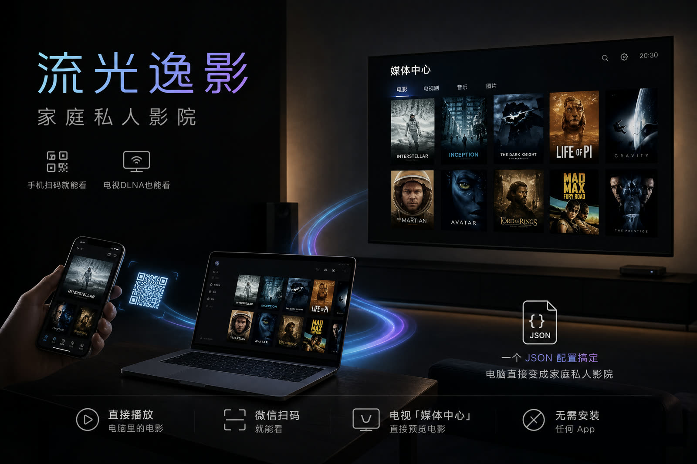

<div align="center">

# 流光逸影
<br>
家庭私人影院：手机扫码、电视DLNA，直接播放电脑里的电影。<br>
**单文件零安装· 扫码即看· DLNA直连 · 一个JSON配置**


[English](README.en.md) | 简体中文




</div>

---

双击运行一个 exe，电脑就变成家庭媒体服务器——手机浏览器扫码即看，智能电视在自带「媒体中心」里直接发现，无需安装任何 App。

## ✨ 功能特性

- **单文件零安装**：一个 exe 搞定，前端页面内嵌在二进制里，配置只有一个 JSON
- **手机即扫即看**：电脑端显示二维码，手机浏览器打开就是影库，支持拖进度条
- **电视 DLNA 直连**：智能电视 / 盒子在「媒体中心 · DLNA」里自动发现，原码率播放 MKV、H.265，由电视本地硬解
- **智能转码**：MP4 直连零开销；浏览器播不动的格式自动调用 ffmpeg 转封装 / 转码，边看边转
- **鼠标选目录**：电脑控制台里点选磁盘文件夹即可共享，改动实时生效
- **稳定播放**：MSE 缓冲水位控制、卡顿看门狗、拖动自动重定位，卡死自动恢复

## 🚀 快速开始

**方式一：下载成品**（推荐）

<!-- TODO(user): 项目发布后，确认 Release 链接可访问 -->
从 [Releases](https://github.com/woyin2024/lengyi-movielan/releases) 下载 `liuguang-yiying.exe`，双击运行。

**方式二：源码构建**（需 Go 1.26+）

```bash
git clone https://github.com/woyin2024/lengyi-movielan.git
cd lengyi-movielan
go build -trimpath -ldflags "-s -w" -o liuguang-yiying.exe
```

双击 `liuguang-yiying.exe`，自动打开电脑控制台，并输出：

```text
============================================
  流光逸影 已启动
  手机浏览器访问: http://192.168.1.3:8090
  电脑控制台(选电影文件夹): http://localhost:8090/pc
  电视/盒子: 在自带「媒体中心/文件管理」的 DLNA 列表里找「流光逸影」
============================================
```

手机与电脑连同一个 Wi-Fi，扫码或输入网址即可开始观影。

## 📖 使用说明

### 配置文件 `config.json`

首次运行自动生成，也可从 `config.example.json` 复制修改：

| 参数 | 类型 | 默认值 | 说明 |
|------|------|--------|------|
| `dirs` | 字符串数组 | `["."]` | 共享的电影目录，支持多个，支持整盘（如 `E:\`） |
| `port` | 数字 | `8090` | 监听端口，被占用时会提示已在运行 |
| `token` | 字符串 | `""` | 访问口令，留空表示不启用；启用后网页需带 `?key=口令` 访问 |

手机端点右上角「目录」、电脑端点选文件夹，都可以增删共享目录，改动立即生效并回写配置。

### 可选依赖 ffmpeg

- 手机网页播放 MKV / H.265 等格式时，需要 `ffmpeg.exe`（含 `ffprobe.exe`）——放到 exe 同目录，或加入 PATH
- 没有也能用：MP4 直接播放不受影响；电视 DLNA 播放走原文件直连、电视本地解码，完全不需要 ffmpeg

### 电视 / 盒子观看

电视与电脑连同一网络，在电视自带的「媒体中心」「文件管理」或 DLNA 应用里找到「流光逸影」，直接浏览播放。若搜不到，检查电脑防火墙是否放行了该程序（首次运行弹窗时点「允许」，需覆盖 UDP 1900 端口）。

## 🔒 安全须知

本项目的定位是**家庭等可信局域网内的自用工具**，使用前请了解：

- **不要把端口暴露到公网**。项目没有为对抗公网攻击设计。
- **口令是弱保护**：`token` 通过 URL 参数传输、非常数时间比较，用于防止家人误访问而非抵御攻击者。
- **DLNA 无鉴权（协议限制）**：即使设置了口令，局域网内任何设备依然可以通过 DLNA 浏览影片列表并拿到播放链接。介意的话请勿在合租 / 办公等不可信网络使用，或用系统防火墙拦截 UDP 1900 端口关闭电视发现。
- **尽量只共享影片目录**：共享整个磁盘（如 `E:\`）意味着局域网内设备可以浏览整块盘的文件。
- **电脑控制台仅限本机访问**：`/pc` 控制台与磁盘浏览器只接受来自本机的连接，局域网其他设备无法操作共享设置。

## ❓ FAQ

<details>
<summary>手机浏览器播放 MKV 卡住或黑屏？</summary>

确认 exe 同目录（或 PATH 中）有 `ffmpeg` / `ffprobe`；仍不行就用播放页的「复制链接到 VLC」按钮，把链接粘到 VLC 播放。
</details>

<details>
<summary>电视搜不到「流光逸影」？</summary>

确认电视与电脑在同一网段；Windows 防火墙首次运行弹窗时选择「允许」；路由器开了 AP 隔离的话需要关闭。
</details>

<details>
<summary>端口 8090 被占用？</summary>

修改 `config.json` 的 `port` 后重启；程序检测到端口占用时会提示「已在运行」并自动打开控制台，不会重复启动。
</details>

## 👤 关于作者

**冷逸** —— 中国 Top AI 技术媒体「**沃垠AI**」博主，不会写代码的 Vibe Coding 开发者，喜欢死磕 Prompt、Skills 和 Agent。产品、运营出身，主打 AI 深度测评。

- **全平台统一账户**：沃垠AI（公众号 · 小红书 · 知乎 · GitHub · B站 · X）
- 扫码关注公众号，获取 AI 测评与 Vibe Coding 实战分享：

<div align="left">

</div>

## 🤝 贡献

欢迎 Issue 和 PR：报告问题请附上启动日志与复现步骤；提交代码请保持单二进制、标准库优先的风格。

## 📄 License

[MIT](LICENSE) © 冷逸
